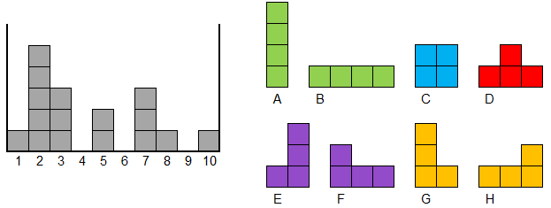

Fudan ACM-ICPC Summer Training Camp 2018

# 第 3 场训练报告

 

薛振梁

2018 年 7 月 26 日

 

### 概况

比赛中通过 8 题，赛后补 3 题，总共通过 11 题。

### 比赛过程

这一场过程比较流畅：C（12min）、A（35min）、B（69min）、I（80min）、H（116min）、K（122min）、E（197min）、J（227min）。

在往后就没什么进展了：花了 30min 看其它题，最后 45min 决定去找 L 的规律。但是忘记了卡特兰数的相关知识，最后半个小时找卡特兰数的公式无果。

### 总结

问题主要出在最后 45min 上，很多基础的知识不太牢固，到了考场上就 GG。适当复习还是很有必要的。

貌似这三场下来没有一道正儿八经的数据结构结构题？

***

### 解题报告

#### A. [Ambiguous Dates](https://codeforces.com/gym/101522/problem/A)

**情况**　AC

**题意**　一个日期 “a/b” 如果按照先月后日和先日后月理解均正确，说明这个日期是有歧义的。现在假设有 $m$ 个月份，每个月份的天数由 $D_i$ 给定。要求适当排列 $D_i$，使得有歧义的日期数量最少。求出这个最小值。$m \leqslant 10^5$。

**题解**　对于月份 $x$，有歧义的天 $y$ 需要满足：

* $x \neq y$
* $1 \leqslant y \leqslant D_x$ 并且 $y \leqslant m$
* $x \leqslant D_y$

为了最小化有歧义的日期，对于 $x$ 比较的小的月份，应尽可能使 $D_y$ 变小。最优的时候就是将 $D_i$ 升序排序。

排序后的计算就非常简单了。时间复杂度 $O(m \log m)$。

#### B. [Bacteria Experiment](https://codeforces.com/gym/101522/problem/B)

**情况**　AC

**题意**　初始给定一棵 $n$ 个点的树，每小时进行一次生长：对于两个不相连的点 $x$ 和 $y$，如果存在另外一个点 $z$，满足 $x$ 和 $z$ 之间有边，并且 $y$ 和 $z$ 之间也有边，那么就添加一条边 $x - y$。问多久后图的形态不会再发生改变。$n \leqslant 5 \times 10^5$。

**题解**　对于任意两条不同的路径，这样的变化相互之间是独立的，无法影响到对方。所以我们只需要考虑树上最长链要多久才会停止变化。

不难发现第一个小时会将距离不超过 $2$ 的点连接，第二个小时会将距离不超过 $4$ 的点连接……因此最后的答案就是对链的长度取以 $2$ 为底的对数。时间复杂度 $\Theta(n)$。

#### C. [Cheering](https://codeforces.com/gym/101522/problem/C)

**情况**　AC

**题意**　给出一个长度为 $n$ 的字符串，比较其中 “`LSC`” 和 “`PCMS`” 出现次数的大小。$n \leqslant 100$。

**题解**　暴力匹配即可。时间复杂度 $\Theta(n)$。

#### D. [*Distribution of Days*](https://codeforces.com/gym/101522/problem/D)

**情况**　**未写代码**

**题意**　有 $q$ 次询问，每次询问给出一个日期和两个数 $S$ 和 $E$，要求求出从 $S$ 年到 $E$ 年中，这个日期的星期数的统计（即每个星期数出现了多少次）。$q \leqslant 5000$，$S,\,E \leqslant 2 \times 10^9$。

**题解**　由于需要考虑到闰年，按照 400 为周期来进行模拟。

#### E. [Expected Score](https://codeforces.com/gym/101522/problem/E)

**情况**　AC

**题意**　有 $2n$ 个箱子，每个箱子里面写了一个 $1..n$ 中的数字，并且每个数字只出现两次。现在来玩一种游戏：每一轮可以任意打开某两个箱子，如果箱子中的数字相同，那么这一轮的得分就是这两个箱子上的数字；否则得分为 0。最后的总得分为所有轮得分中的最大值。已知前 $R - 1$ 轮的游戏操作和结果，现在要制定一个第 $R$ 轮的策略，使得最终得分的期望值尽可能高。求出最高的期望得分。$n,\,R \leqslant 10^5$。

**题解**　策略分为三种，依次考虑其期望最终得分。设 $a$ 表示前 $R - 1$ 轮的得分，未知的箱子数为 $r$。

* 选取两个已知的箱子：取其中的最大值即可。
* 选取一个已知，另一个瞎选：这里只用考虑比 $a$ 大的数字，假设决定选取 $x$，则期望为 $(x + a (r - 1)) / r$。
* 两个箱子都瞎选：同样只需考虑大于 $a$ 的数字，设它们的总和为 $s$，个数为 $m$。令概率 $p = 1 / {r \choose 2}$，则期望为 $sp + a(1 - mp)$。

时间复杂度 $\Theta(n)$。

#### F. [Frustrating Game](https://codeforces.com/gym/101522/problem/F)

**情况**　已补

**题意**　一开始有 $n$ 个球，染成蓝色或者红色。每次操作可以选取 $R$ 个红球和 $B$ 个蓝球，将它们变成白色，并且这 $R + B$ 个球之间不能夹有白球。问最后能否将所有球都变成白球，如果有，还需要输出方案。$n \leqslant 10^5$。

**题解**　假设有这样的方案，那么最后一次操作的 $R + B$ 个球一定是连续的。

之后，忽略掉这 $R + B$ 个球，倒数第二次操作的 $R + B$ 个球也是连续的。再考虑到 $R = B = 1$ 的特殊情况，发现此时相当于括号序列。

不难想到使用一个栈，将球从左至右进栈。如果栈顶的 $R  + B$ 个球满足要求，则作为一次操作，并从栈顶弹出。利用上面的性质，最后一次操作的球会优先从栈中弹出，然后倒数第二次操作的球就会变得连续，从而又能够在栈顶弹出。如果这个算法找不出方案，则原问题无解。时间复杂度 $\Theta(n)$。

#### G. [Gravitational Tetris](https://codeforces.com/gym/101522/problem/G)

**情况**　已补

**题意**　俄罗斯方块游戏的一个变种：所有小方格之间没有连接，会直接掉到最底下；高度没有限制。此外，方格消除的条件还是一样的。`A`-`H` 是 8 种方块（所有可能的形态都计入了），可以任意使用。目标是要消除所有的方格，并给出方案。使用方块的上限为 1000。游戏一共有 10 列。题目保证有解。

**题解**　因为保证有解，而每种方块都由 4 个方格组成，所以最后一定是消去偶数行，一共消去偶数个方格。

这里需要注意到 1000 实际上是个非常宽松的上界，并且题目没有特殊的要求，只要给出可行的方案就好了。所以应该考虑构造的方法。设定一个目标消除高度 $H$（如 200），并且 $4 \mid H$，然后：

* 对于 1..9 列，如果当前列上方格数为 4 的倍数，则不停加入 `A`，直到到达 $H$。
    * 如果不是，则加入 `G`，这样高度模 4 的值会发生改变，直到高度为 4 的倍数时停止。
* 对于最后一列，因为总个数为偶数，而前面的高度都是 4 的倍数，所以最后一列的高度模 4 的值要么是 0 要么是 2。
    * 如果等于 0，则直接添加 `A`。
    * 否则就等于 2，此时先添加一个 `E`，在不断添加 `A` 直到填满。最后 9、10 列上方会多出一格，此时 1..8 添加两个 `B` 即可填平。

#### H. [Hit!](https://codeforces.com/gym/101522/problem/H)

**情况**　AC

**题意**　给出两个有交集的圆，需要任意输出一个在交集内的点的坐标。

**题解**　我的做法是连接圆心，求出两个圆与这条线的交点，然后输出这两个交点的中点。这样就少考虑了一种情况：有可能忘记考虑其中一个圆心在另外一个圆里面的情况。此时特判一下即可。时间复杂度为 $\Theta(1)$。

#### I. [Inverted Signs](https://codeforces.com/gym/101522/problem/I)

**情况**　AC

**题意**　给定长度为 $n$ 的序列 $H$，现在可以将一段区间内的元素符号取反，要求最小化 $\sum_{k = 1}^{n - 1} |H_{k + 1} - H_k|$。$n \leqslant 10^6$。

**题解**　对于这个和式，只有区间两个端点处的项会发生变动。

所以对于每个位置计算出取反后的变化值，然后从左至右扫描一遍区间右端点，在左边选取变化最小的左端点。时间复杂度 $\Theta(n)$。

#### J. [Juicy Candies](https://codeforces.com/gym/101522/problem/J)

**情况**　AC

**题意**　有三种糖果，分别为 `B`、`R`、`S`，并且分别有 $b$、$r$、$s$ 个。现在将它们排成一排，要求相邻两个糖果种类不能相同。求出这样的序列中字典序第 $K$ 小的序列。$B,\,R,\,S \leqslant 200$，$K \leqslant 10^{18}$。

**题解**　首先计算一个 DP：令 $f[i][j][k][s]$ 表示以 $s$ 开头，三种糖果总数分别还有 $i$、$j$、$k$ 个的合法序列总数。利用这个 DP 的结果就可以从第一位开始试位，找到第 $K$ 小的序列。

由于方案数可能很大，所以对于大于 $K$ 的 DP 值，存成 $K + 1$ 就可以了，避免爆 `long long`。时间复杂度 $\Theta(brs)$。

#### K. [Knights](https://codeforces.com/gym/101522/problem/K)

**情况**　AC

**题意**　题目太过奇怪就不写了吧……

**题解**　显然四个角都要占啊，所以看一看就好了……

  

#### L. [Let Me Count The Ways](https://codeforces.com/gym/101522/problem/L)

**情况**　已补

**题意**　有两排格子，第一排有 $n$ 个，第二排有 $m$ 个（$n \geqslant m$）。在其中填入 $1..n + m$，要求每个格子比自己右边和下面的数字都要大，问总方案数。答案对 $10^9 + 7$ 取模。$n \leqslant 10^9$。

**题解**　注意到两排都是递减的序列，可以将第一排的视为左括号，第二排的视为右括号，因此最后的答案就是一般的卡特兰数。

其中需要计算一个组合数，给阶乘分段打标就 OK 了。