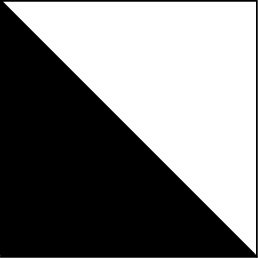

 
Fudan ICPC Summer Training Camp 2019

# 第一场个人赛训练报告

 

薛振梁

2019 年 7 月 22 日

 

### 概况

比赛中通过 7 题，赛后补 3 题，总共通过 10 题。

### 比赛过程

基本上就是按顺序写题 + 跟榜。D 题由于一些细节问题改了几次才改对。E 题最开始想到的做法是错误的，之后就先去跟榜做了 J 题，。然后上厕所时突然发现自己想复杂了，回来后就过了 E 题。之后就在看 K、L、M 三题，只有 M 题比较快地想出来了，然后时间只剩下 30min，没有想出 K、L 该怎么做。

### 总结

这一次 D、E、K、L 都是有点构造的题目，我对构造类的题目一直不是很擅长，在这些题上面花的时间较多。今后训练对构造类的题目要多尝试一点。

***

### 解题报告

#### A. [Prime Minister](http://codeforces.com/problemset/problem/1178/A)

**情况**　通过

**题意**　有 $n$ 群人，第一群人希望拉拢其它的人群，被拉拢的人群的人数不能超过第一群人的一半，问第一群人最后拉拢到的人加原本有的人数能否严格超过总人数的 ½。

**题解**　贪心地把所有能加进来的人都拉进来即可。

#### B. [WOW Factor](http://codeforces.com/problemset/problem/1178/B)

**情况**　通过

**题意**　给定一个长为 $n$ 的仅包含 `v` 和 `o` 的字符串，两个连续的 `v` 可以视作一个 `w`，问字符串中有多少个形如 `wow` 的子序列。$n \leqslant 10^6$。

**题解**　预处理出每个前缀和后缀中 `w` 的个数，然后枚举中间 `o` 计算。

#### C. [Tiles](http://codeforces.com/problemset/problem/1178/C)

**情况**　通过

**题意**　用下图的瓷砖（可以旋转）铺满一个 $w\times h$ 的网格，要求网格中每条边两边的颜色不能相同，问有多少种铺法。$w,\ h \leqslant 1000$。

**题解**　注意到当确定了第一行和第一列后，其余瓷砖的摆放方式就也被确定了。此时最左上角的瓷砖有 $4 = 2^2$ 种摆法，第一行和第一列的其余瓷砖根据前一个瓷砖的摆法，自己只有 $2$ 种摆法。故答案为 $2^{w+h}$。

#### D. [Prime Graph](http://codeforces.com/problemset/problem/1178/D)

**情况**　通过

**题意**　给定 $n$，要求构造一个简单图，满足每个点的度数是质数，以及总边数也是质数。$3 \leqslant n \leqslant 1000$。

**题解**　考虑用三元环和五元环组成简单图，此时仅有 $n = 4$ 和 $n = 7$ 不能被表示出来，特判即可。之后需要使得总边数为质数，注意到两个度数为二且没有连边的点之间可以加入一条新边而不违反度数的要求，因此通过这样的加边使得总边数为质数为止。

#### E. [Archaeology](http://codeforces.com/problemset/problem/1178/E)

**情况**　通过

**题意**　给出一个长为 $n$ 且仅包含 `a`、`b` 和 `c` 三种字符的字符串，保证相邻两个字符不同，要求在其中找出一个长度至少为 $\lfloor n/2 \rfloor$ 的回文子序列。$n \leqslant 10^6$。

**题解**　由于字符串的特殊性，其保证了任意四个字符中必有一对相同字符。因此从两端开始每轮找出一对放入回文序列即可。可能还需要在中间任意挑出一个字符作为回文序列的中心。

#### F/G. [Long Colorful Strip](http://codeforces.com/problemset/problem/1178/F2)

**情况**　补题通过

**题意**　有 $n$ 中颜色，每种颜色依次在一条长为 $m$ 的带子上染色，初始时带子上没有颜色。每次染颜色 $i$ 可以选择一段连续的、同色的区间，将这个区间变为颜色 $i$。现在给出最终的染色情况，问有多少种染色方案使得最后的结果是给出的染色情况。数据保证每种颜色均在最终情况中出现至少一次。$n \leqslant 500$，$m \leqslant 10^6$。

**题解**　对于一种染色情况，记颜色 $i$ 在序列中最左边的出现位置为 $L_i$，最右边的位置为 $R_i$。首先判断是否有解。染色情况是合法的当且仅当对于颜色 $i$，区间 $[L_i,\ R_i]$ 不存在序号比 $i$ 小的颜色。如果情况合法，不难发现所有颜色构成的区间可以组织成一棵树，而树上每一层的染色方法不会影响其它层的情况。因此，对于树上某一层连续的（区间 $[L_i,\ R_i]$ 相连）几个颜色来说，可以使用 $\mathrm O(n^3)$ 的区间 DP 解决其间的染色方案数。设 $f[l][r]$ 表示仅考虑 $[l,\ r]$ 内的所有颜色的染色方案数，我们只用考虑编号最小的颜色是如何染色的即可，转移很简单。最后将每个节点处计算出的答案乘起来就是总方案数。时间复杂度 $\mathrm O(nm + n^3)$。

#### J. [Add on a Tree](http://codeforces.com/problemset/problem/1188/A1)

**情况**　通过

**题意**　给定一棵树，初始时树上边权均为 $0$。每次操作可以选取两个叶子，将两个叶子间的简单路径上的所有边加上一个实数边权。问能否通过这些操作使得所有边的边权为任意值。

**题解**　首先如果树上有 $2$ 度点，那么显然不行。设叶子数量为 $m$，只要叶子对的数量 ${m \choose 2}$ 不小于 $n - 1$，那么这些操作就可张成 $n - 1$ 维空间，此时就是可以的。

#### K. [Add on a Tree: Revolution](http://codeforces.com/problemset/problem/1188/A2)

**情况**　补题通过

**题意**　给定一棵 $n$ 个点的树，初始时树上边权均为 $0$。每次操作可以选取两个叶子，将两个叶子间的简单路径上的所有边加上一个整数边权。现给出树上每条边的最终边权，要求构造一组操作使得树上边权变为目标边权。$n \leqslant 1000$。

**题解**　考虑以某个叶子 $r$ 为根建成有根树，从下至上考虑每个节点向父亲的连边，对于叶子 $x$，我们可以通过 $x$ 到 $r$ 的路径来消去叶子父亲的边权。对于其它节点，不妨设节点 $x$ 到父亲的边权为 $c$，$x$ 的两个儿子下的叶子分别为 $y$ 和 $z$，以及 $x$ 到这两个儿子的边权分别为 $b$、$c$，假设所有儿子的边权已经处理完成，那么 $x$ 的父亲还需要消去 $Δ = c - (a + b)$ 的边权。因此 $y$ 和 $z$ 分别到 $r$ 加上 $Δ/2$ 的权值，然后在 $y$ 到 $z$ 减去 $Δ/2$ 的权值来消去影响，就可以解决 $x$ 到父亲的边上的权值。无解的情况有两种，一是 $x$ 下面没有两个儿子，而相连的边边权不同。二是上述 $Δ$ 不是偶数。时间复杂度 $\Theta(n)$。

#### L. [Count Pairs](http://codeforces.com/problemset/problem/1188/B)

**情况**　补题通过

**题意**　给定 $n$ 个不同的整数 $a_1,\ ...,\ a_n$，以及质数 $p$ 和参数 $K$，问有多少对 $i < j$ 满足 $(a_i+a_j)(a_i^2+a_j^2) \equiv K \pmod p$。$n \leqslant 3\times 10^5$，$p \leqslant 10^9$，$K \in [0,\ p - 1]$。

**题解**　将上述等式两边同乘 $a_i - a_j$，整理后可得 $a_i^4 - Ka_i \equiv a_j^4 - Ka_j \pmod p$，之后用哈希表统计即可。

#### M. [Array Beauty](http://codeforces.com/problemset/problem/1188/C)

**情况**　通过

**题意**　给定 $n$ 个整数 $a_1,\ ...,\ a_n$，以及参数 $m$，定义一堆整数的 Beauty 值为其中两两之差的最小值。问从这 $n$ 的数中抽出 $m$ 个数的所有方案的 Beauty 值之和为多少。$m\leqslant n \leqslant 1000$，$a_i \leqslant 10^5$。

**题解**　考虑逐次累加贡献。给定 $C$，令 $f[i][j]$ 表示前 $i$ 个数中抽出 $j$ 个，且两两之间差不小于 $C$ 的方案数。这个 DP 在排完序后用前缀和优化可以做到 $\Theta(nk)$ 的复杂度。令 $A = \max\{a_i\}$，不难注意到 $C \leqslant A / (k - 1)$，故总复杂度为 $\mathrm O(nA)$。
